# Pyramid-Puzzle-Solver
This is a puzzle solver created from scratch by myself, with the purpose of practice and fun. If you are looking for a solver for the puzzle below or interested in how the solver was formulated, this page is for you! Disclaimer: I did not create the puzzle.  
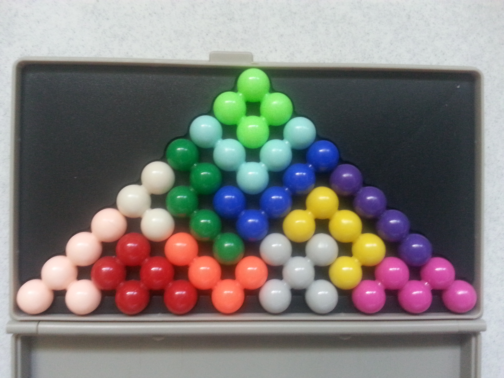
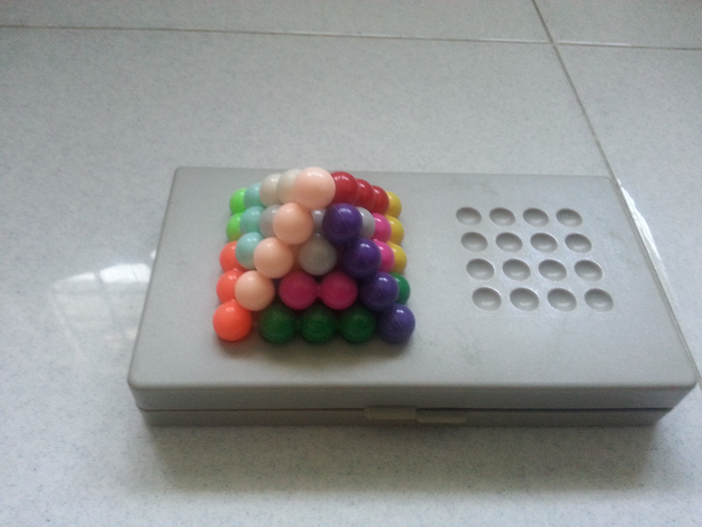

If you are only interest in using the solver:  
(Note: There seems to be numerous printing errors in the puzzle book provided, neither can the solver nor I solve them.  
After attempting to solve any puzzle, the solver should be restarted.)  
Below is an example of a 2D puzzle.  
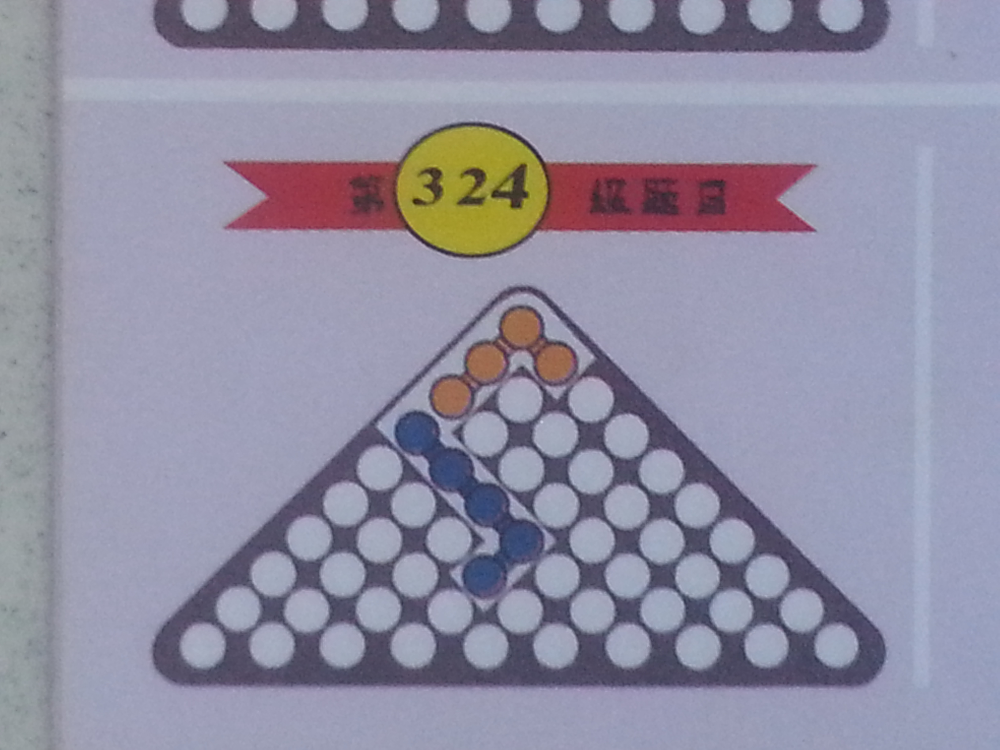  
Start up twoDimUi.java. The solver should look like this.
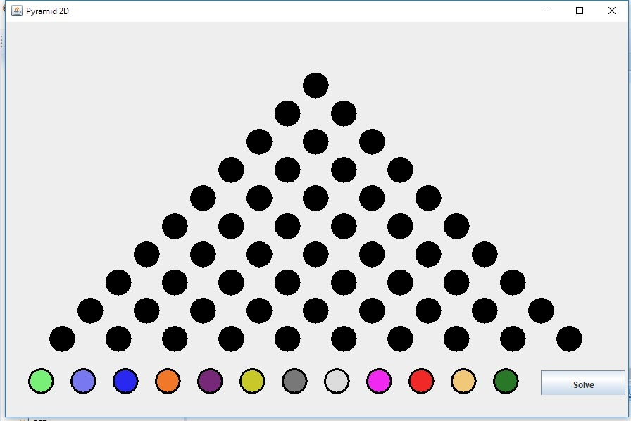  
First, mark out all blocks that are occupied using Left Click.  
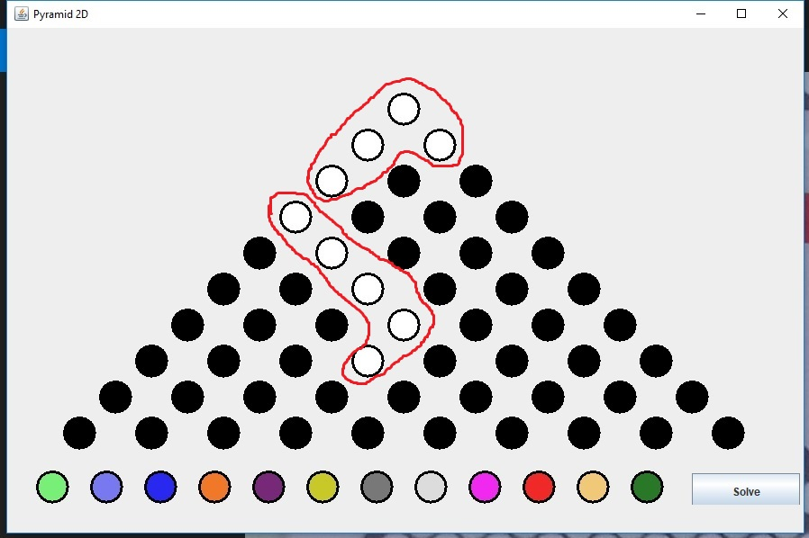  
Next, remove the corresponding colour of those blocks from the "available pieces" by clicking on the colour found in the bottom row.  
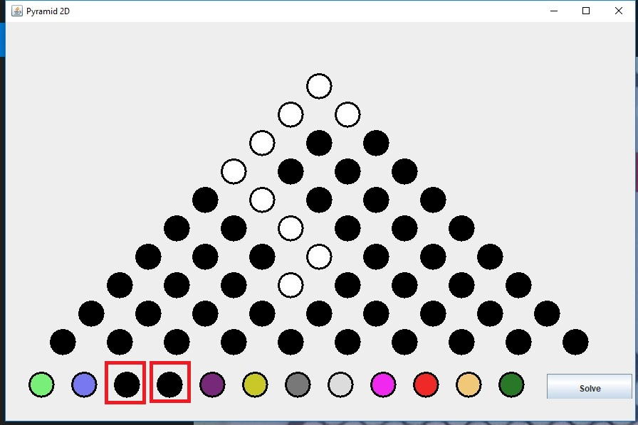  
Proceed to press the solve button. The solver should output a solution after some time (normally within seconds), or print "FAIL" to your console should it fail to find a solution.  
  
2D puzzles are easy, how about the 3D puzzles?  
Below is an example of a 3D puzzle.  
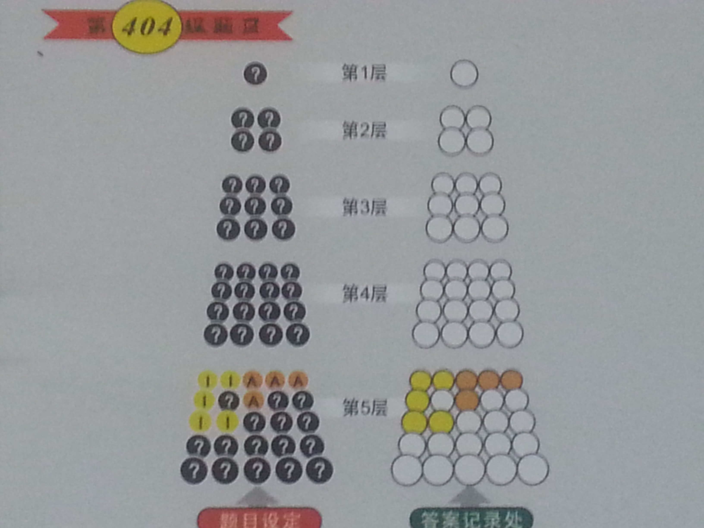  
Start up threeDimUi.java. The solver should look like this.
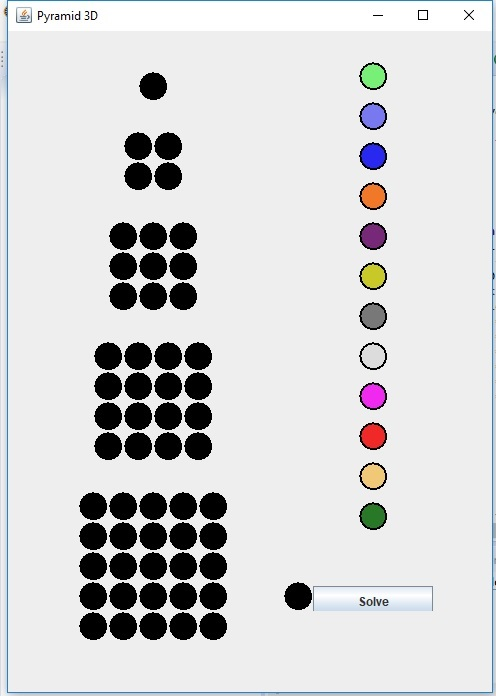  
First, mark out all blocks that are occupied using Left Click.  
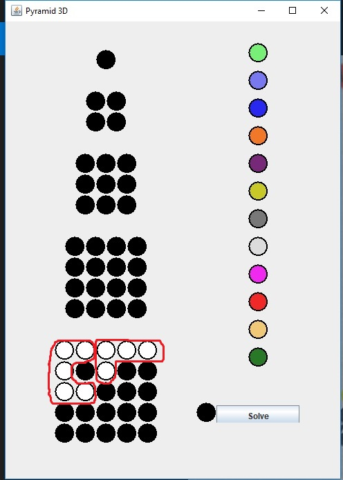  
Next, remove the corresponding colour of those blocks from the "available pieces" by clicking on the colour found in the column on the right.  
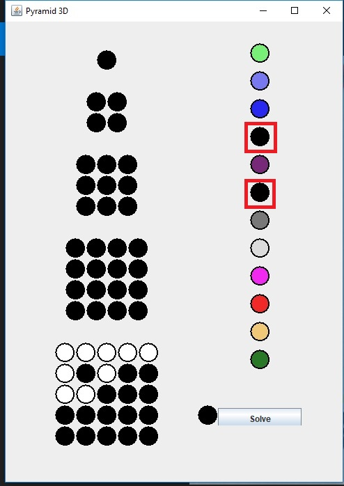  
Proceed to press the solve button. The solver should output a solution after some time (may take minutes, be patient), or print "FAIL to your console should it fail to find a solution.  
  
Help, what about 3D puzzles that have single-grid block pieces?  
Don't worry, the solver is able to deal with them, just that the "single block" UI may bug when pieces are removed. If you think the solver bugged, try restarting the solver. Some puzzles does not seem to have a valid solution though.  
Below is an example of a 3D extended puzzle.  
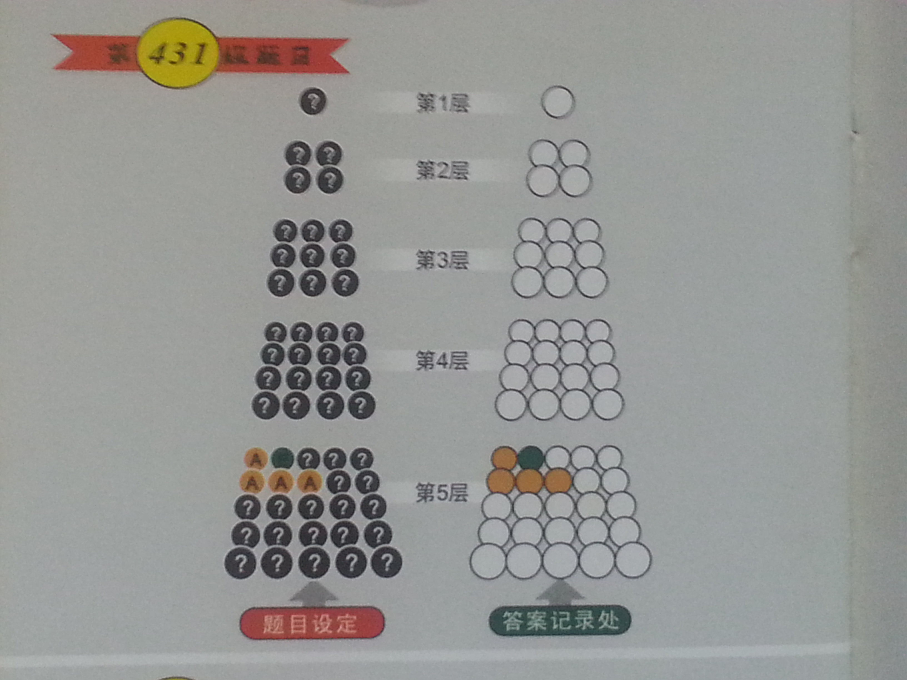  
Start up threeDim.java, mark out all complete blocks as per normal.  
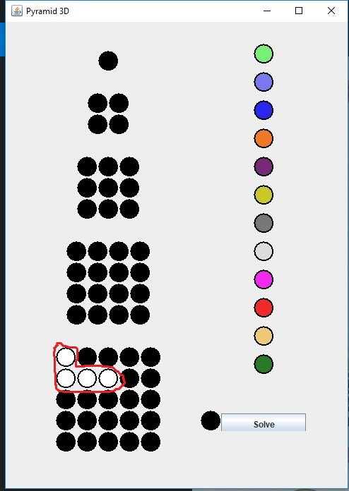  
Next, mark out the single-grid block, then proceed to change its colour by clicking on the tile as indicated by the image below. Click until you see the colour you want.  
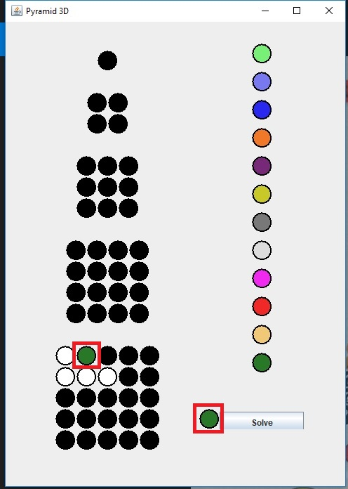  
Proceed to press the solve button. The solver should output a solution after some time (may take minutes, be patient), or print "FAIL to your console should it fail to find a solution.  

How was this puzzle decomposed in the solver?  
The 2D puzzle:  
Some blocks can be rotated and/or flipped. These will be explained later. For now, just assume all blocks cannot be rotated and flipped. This solver is implemented using DFS  
Blocks can be translated along the 2D plane. To standadize the position, an origin is defined. The position of the block can be represented by the co-ordinates of its topmost grid.  
The strategy used for solving the puzzle is: how should the current topmost empty-grid be filled? If we treat this empty-grid of interest as the origin, we are only interested in block positions where the empty-grid will be filled. This leads us to the tuples of co-ordinates in the source code:
```
  //The layout for the square piece
	//..
	//..
	private static final int[][] layouts1 = {
			{0, 0, 1, 0, 0, 1, 1, 1},
			{-1, 0, 0, 0, -1, 1, 0, 1},
			{0, -1, 1, -1, 0, 0, 1, 0},
			{-1, -1, 0, -1, -1, 0, 0, 0}};
```
In an attempt to fill this empty-grid, the solver iterates through every single piece and their positions. It will backtrack when there are no valid moves, or recursively try to fill the entire board.  
WAIT, aren't some pieces rotatable/flippable?  
To handle flipping, the XY co-ordinates of the list on top are swapped. To handle rotation, their co-ordinates are multiplied by:  
```
	private static final int[][] rotation = {{1, 1}, {-1, 1}, {1, -1}, {-1, -1}};
```
With this, the 2D solver is complete...  
  
What about the 3D solver?  
It is the 2D puzzle with 2 extra planes. Instead of only having a XY plane, now it has a plane along the X-axis and a plane along the Y-axis. The logic behind the solver still holds. In the case of single-grid block restrictions, the solver is simply forced to use that coloured block to fill the grid.  
Currently the tutorial/walkthrough of the creation of the solver is still quite sketchy, will update when time permits. Enjoy!  

